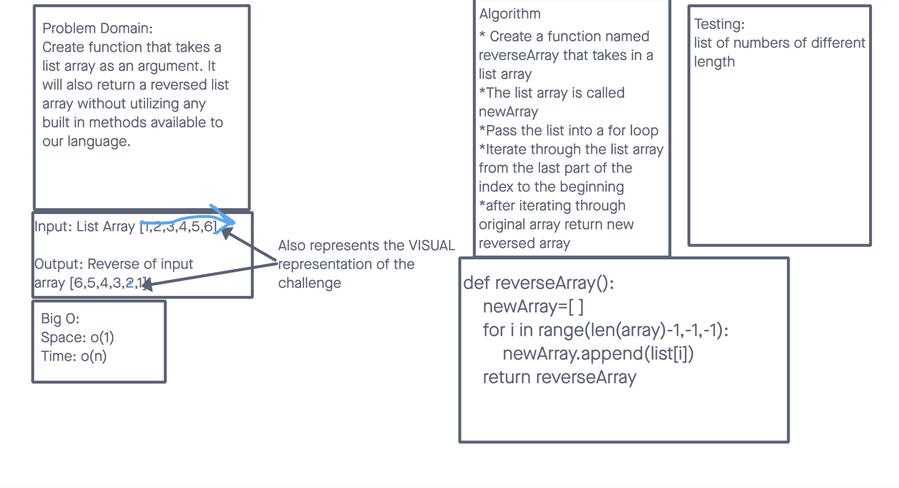

# Reverse an Array
This challenge expects a whiteboard that includes a function that takes in a list, with its output produces the same list but reversed.

## Whiteboard Process

## Approach & Efficiency
Took the approach with the intent to iterate over the array to append the numbers at the end of the list and return the new list.
