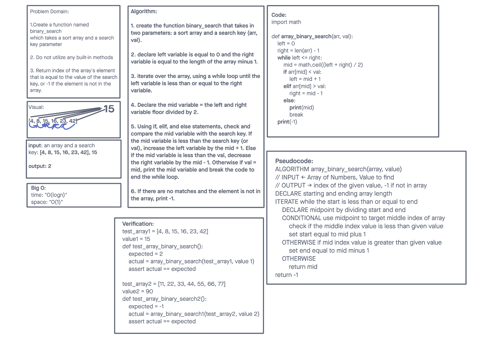

# Array Binary Search
This assignment instructed us to create a function that takes two parameters: a sort array and a search key. The task was to return the index of the array’s element that is equal to the value of the search key, or -1 if the element is not in the array.

## Whiteboard Process

## Approach & Efficiency
Our approach was initially to create a function that took in two parameters. We first examined the gif example, and using deductive reasoning, we came up with the solution to either increase or decrease the potential mid number. The mid number would finally equate to the val (or search key) and end the code. If the number was not in the array, it would return a value of -1.

[Source](https://en.wikipedia.org/wiki/Binary_search_algorithm)

[<==BACK](../../README.md)
