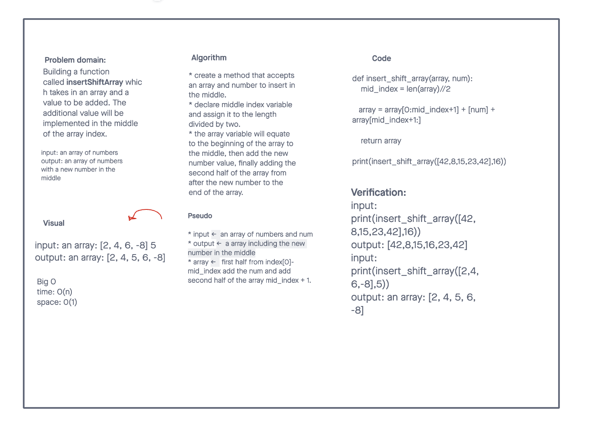

# Insert to Middle of an Array
This assignment instructed us to create a function that takes an array and a value and implements the new number to the middle.

## Whiteboard Process

## Approach & Efficiency
Our approach was initially to create a function that included the insert method. However, after thinking about the process, we googled ways to add values into the middle of the array and came across a very simple method that added the sum of the beginning of the array, the new value, and the end of the array.

[Source](https://stackoverflow.com/questions/48561673/adding-items-in-the-middle-of-a-list-in-python)

[<==BACK](../../README.md)
