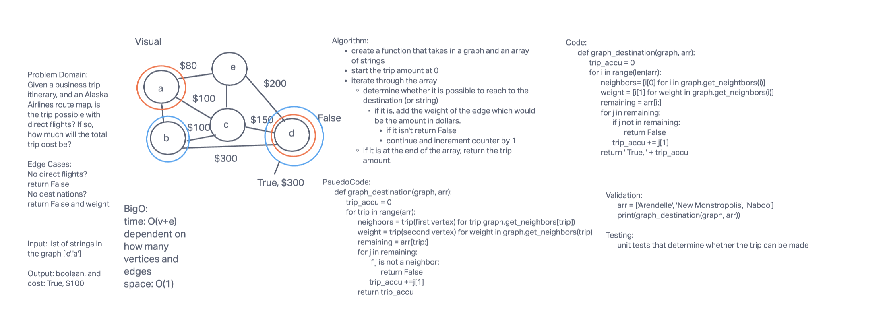

# Graphs

[Pull Request](https://github.com/bran2miz/data-structures-and-algorithms/pull/80)

The code challenge assigned today gave us the opportunity to create our own graph and methods to add vertices, edges, and more.

## Challenge

In today's code challenge we had to implement our own Graph. The graph should be represented as an adjacency list.

## Approach & Efficiency

This code challenge was challenging, as we had to formulate code without any sort of pseudo code. I first took the approach of creating the add_node method. I then created the size method (seemingly easy as we were assigned to find the total number of nodes in the graph). Creating the methods were difficult.

The Big(O):
    time: O(1)
    space: O(n) because the amount of conversions grows depending on the amount of keys.

## API

We had to create the methods:

- an add_node method
Arguments: value
Returns: The added node
Add a node to the graph

- add edge method
Arguments: 2 nodes to be connected by the edge, weight (optional)
Returns: nothing
Adds a new edge between two nodes in the graph
If specified, assign a weight to the edge
Both nodes should already be in the Graph

- get_node method
Arguments: none
Returns all of the nodes in the graph as a collection (set, list, or similar)

get_neighbor method
Arguments: node
Returns a collection of edges connected to the given node
Include the weight of the connection in the returned collection

- size method
Arguments: none
Returns the total number of nodes in the graph

[Source](https://python-course.eu/applications-python/graphs-python.php)

[Source](https://www.educative.io/edpresso/how-to-implement-a-graph-in-python)

## Code Challenge 36 Graph Breadth First

[Pull Request](https://github.com/bran2miz/data-structures-and-algorithms/pull/83)

Implement a breadth-first traversal on a graph.

## Whiteboard Process

## Approach & Efficiency (CC 36)

Base Case first:
if there are no vertices, return an empty list.

- Declare queue, lists as an empty list, and visited as set()

- Enqueue the root.

- Add the root to the visited set.

- Enter a while loop so long as the queue is not empty; runs until there are no more nodes in our queue.

- Dequeue the front node and then check to see if it has any children.

- if there are children of the node we are currently looking at, we want to add them to visited set.

- Place any of its children that have not yet been visited into the queue.

- return the list of nodes. This list will contain, in order, all the nodes that were traversed.

BigO:
time: O(v+e) the v is the number of vertices and the e represents the number of edges
space: O(v)

## Solution

## Code Challenge 37 Graph Business Trip

[Pull Request](https://github.com/bran2miz/data-structures-and-algorithms/pull/84)

## Whiteboard Process (CC 37)

## Approach & Efficiency (CC 37)
<!-- What approach did you take? Why? What is the Big O space/time for this approach? -->

## Solution (CC 37)
<!-- Show how to run your code, and examples of it in action -->
## Credit and Collaborators

Eddie Ponce

Alex Payne

Michael Greene

Roger Huba
