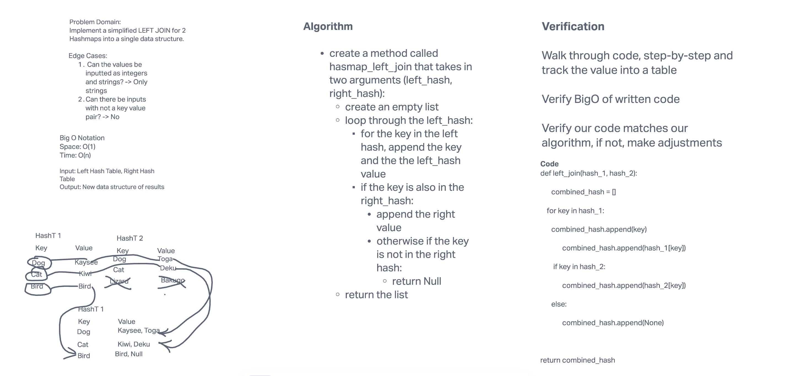

# Hashmap LEFT JOIN
<!-- Short summary or background information -->

## Challenge
<!-- Description of the challenge -->

## Approach & Efficiency

What approach did you take? Why?

Big(O):
time: O(n)
space: O(1)

## Solution

