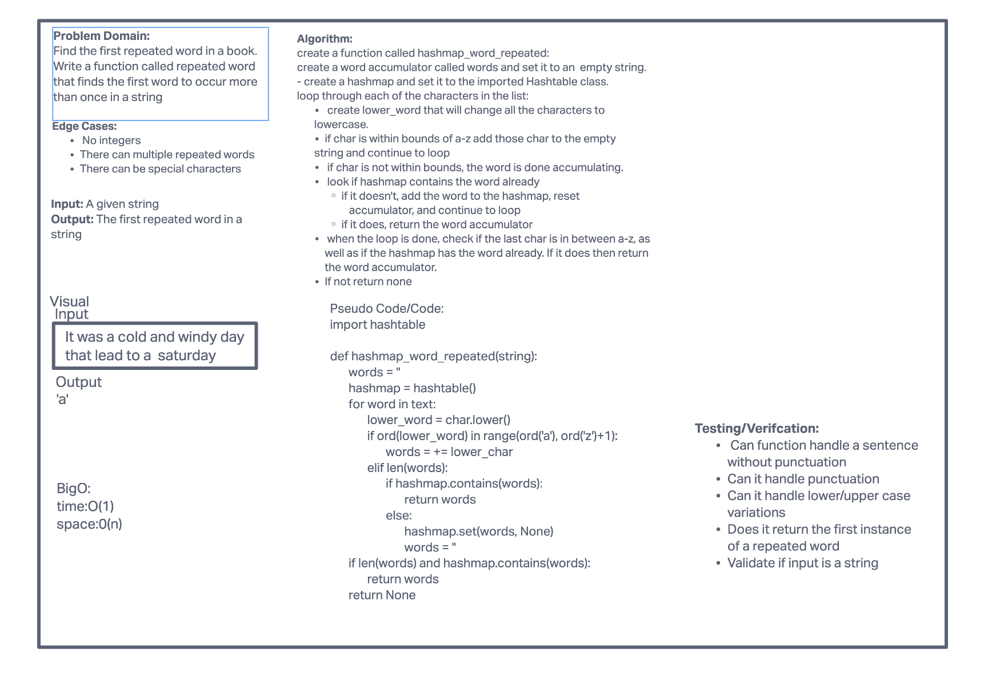
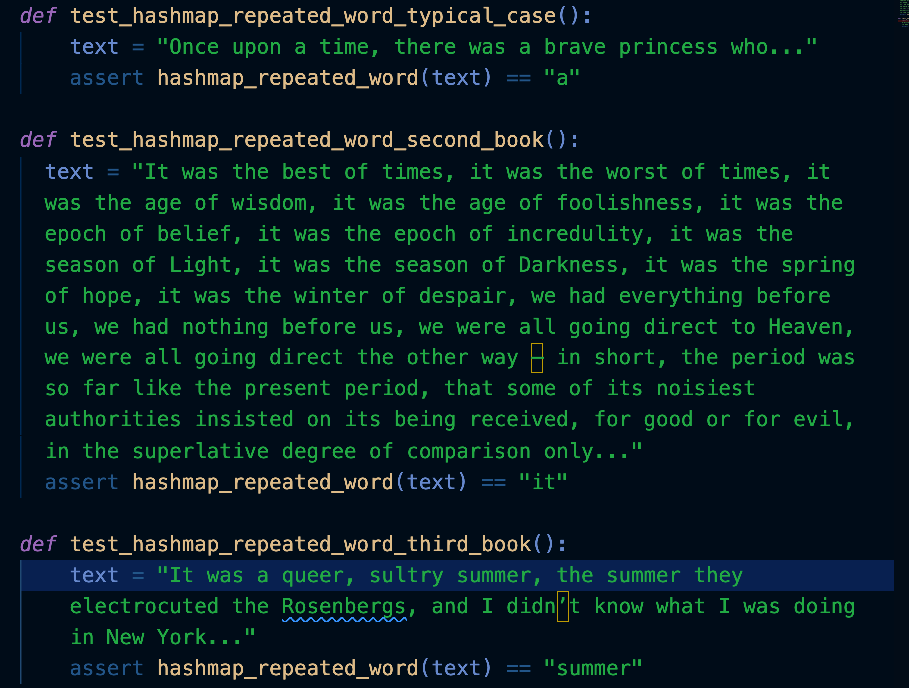
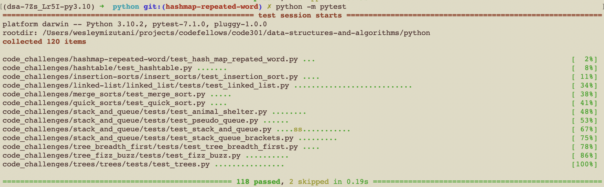

# Challenge Summary

[Pull Request Link](https://github.com/bran2miz/data-structures-and-algorithms/pull/74)

The challenge today was to write a function that locates the first repeated word in a hashmap.

## Whiteboard Process

## Approach & Efficiency

The approach that I took was to import hash table. Then change the characters to lower characters. Then iterate through the letters that are in the scope of a-z. If it is not, the code will continue to check if there are repeats. If there is, then it will return the first repeated word. If not it will continue to throughout the phrase until there will find a repeated word.

BigO:
time: O(1)
space: O(n)

## Solution

