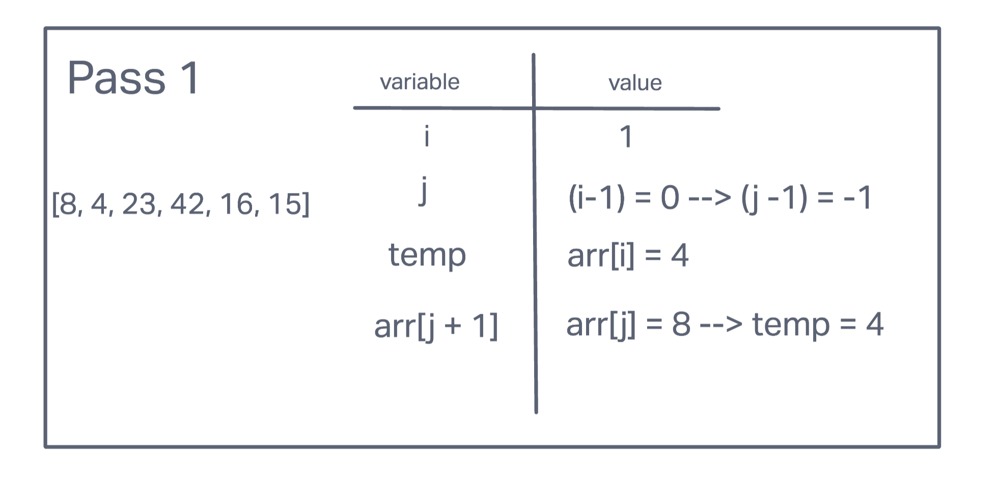
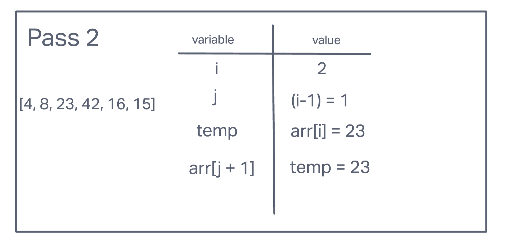
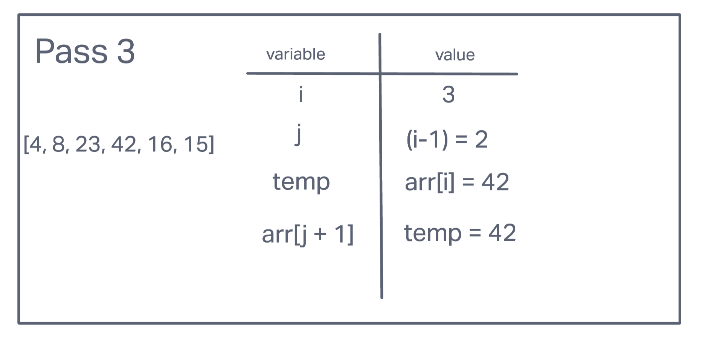
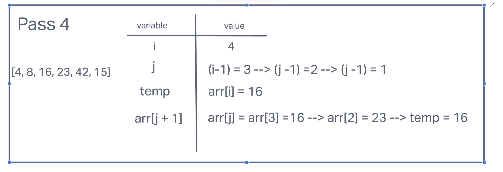
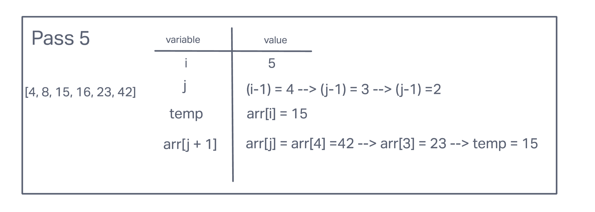
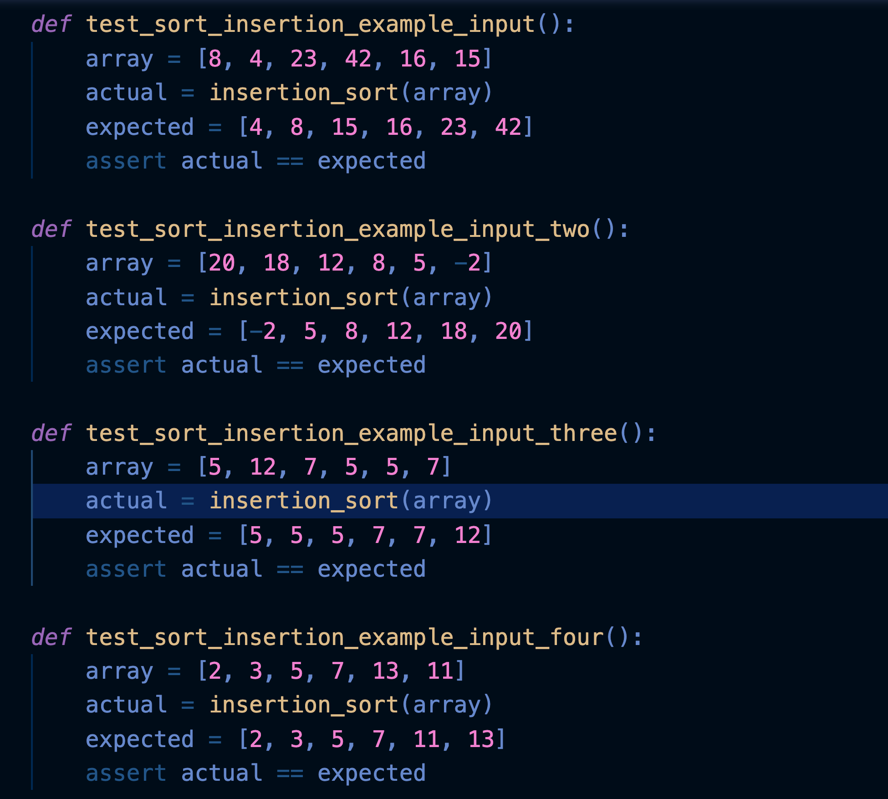

# Insertion Sort

Insertion sort takes an array and splits it into a sorted an unsorted "pile". The values from the unsorted pile are selected and inserted at the desired position in the sort pile.

## Challenge Summary

Review the pseudo code, then trace the algorithm by stepping through the process with the provided sample array. Document your explanation by creating a blog article that shows the step-by-step output after each iteration through some sort of visual.

Once you are done with your article, code a working, tested implementation of Insertion Sort based on the pseudo code provided.

## Pseudo Code


## Trace

Sample Array:

```python
[8,4,23,42,16,15]
```

### Pass 1

In the first pass through of the insertion sort, it is first setting the integer, i, to a numerical value of 1. Through a for loop, it will continue to compare the two values, in sequential order, in the array until there are no more numbers left.

Within the for loop, the variable j is set to be the value of i subtracted by 1. In this first pass through, i-1 would equate to 0. The variable, temp, also is set to the array at i (arr[i]). In this pass, arr[1] which is 4.

At this point, there is a while loop that evaluates whether j is greater than or equal to 0 as well as temp is less than the array at j (arr[j]). Both conditions are met, where j = 0 >= 0 and temp = 4 < arr[0] = 8 and the while loop is entered.

Within the while loop, the array at j + 1 is reassigned the value of the array of j. Arr[1] is altered to equate to arr[0], which in the array at the index of 0, is 8.

The variable j is reassigned the value of j subtracted by 1. Thus, j = 0 <== 0 - 1 = -1.

The while loop is tried once again. However, due to the fact that our new integer j = -1, the while loop is never entered. Finally, the new temp is equal to the array at j + 1. Because our new value of j = -1, temp = -1 + 1 = 0. The value at the index of 0 is 4, so temp = 4.

New Pass = [4, 8, 23, 42, 16, 15]



### Pass 2

In the second pass through of the insertion sort, it is first setting the integer, i, to a numerical value of 2. Through a for loop, it will continue to compare the two values, in sequential order, in the array until there are no more numbers left.

Within the for loop, the variable j is set to be the value of i subtracted by 1. In this second pass through, i-1 would equate to 1. The variable, temp, also is set to the array at i (arr[i]). In this pass, arr[2] which is 23.

At this point, there is a while loop that evaluates whether j is greater than or equal to 0 as well as temp is less than the array at j (arr[j]). Both conditions are not met, where j = 1 >= 0 but temp = 23 is not less than arr[1] = 8 and the while loop is not entered.

Finally, the new temp is equal to the array at j + 1. Because our new value of j = 1, temp = 1 + 1 = 2. The value at the index of 2 is 23, so temp = 23. The temp value isn't changed and it remains at that position.

New Pass = [4, 8, 23, 42, 16, 15]



### Pass 3

In the third pass through of the insertion sort, it is first setting the integer, i, to a numerical value of 3. Through a for loop, it will continue to compare the two values, in sequential order, in the array until there are no more numbers left.

Within the for loop, the variable j is set to be the value of i subtracted by 1. In this third pass through, i-1 would equate to 2. The variable, temp, also is set to the array at i (arr[i]). In this pass, arr[3] which is 42.

At this point, there is a while loop that evaluates whether j is greater than or equal to 0 as well as temp is less than the array at j (arr[j]). Both conditions are not met, where j = 2 >= 0 but temp = 42 is not less than arr[2] = 23 and the while loop is not entered.

Finally, the new temp is equal to the array at j + 1. Because our new value of j = 2, temp = 2 + 1 = 3. The value at the index of 3 is 42, so temp = 42. The temp value isn't changed and it remains at that position.

New Pass = [4, 8, 23, 42, 16, 15]



### Pass 4

In the fourth pass through of the insertion sort, it is first setting the integer, i, to a numerical value of 4. Through a for loop, it will continue to compare the two values, in sequential order, in the array until there are no more numbers left.

Within the for loop, the variable j is set to be the value of i subtracted by 1. In this fourth pass through, i-1 would equate to 3. The variable, temp, also is set to the array at i (arr[i]). In this pass, arr[4] is 16.

At this point, there is a while loop that evaluates whether j is greater than or equal to 0 as well as temp is less than the array at j (arr[j]). Both conditions are met, where j = 3 >= 0 and temp = 16 < arr[3] = 42 and the while loop is entered.

Within the while loop, the array at j + 1 is reassigned the value of the array of j. Arr[4] is assigned to equate to arr[3], which in the array at the index of 3, is 42.

The variable j is reassigned the value of j subtracted by 1. Thus, j = 3 <== 3 - 1 = 2.

The while loop is tried once again. Both conditions are met, where j = 2 >= 0 and temp = 16 < arr[2] = 23 and the while loop is entered.

Within the while loop, the array at j + 1 is reassigned the value of the array of j. Arr[3] is altered to equate to arr[2], which in the array at the index of 2, is 23.

The variable j is reassigned the value of j subtracted by 1. Thus, j = 2 <== 2 - 1 = 1.

The while loop is tried once again. Both conditions are not met, where j = 1 >= 0 but temp = 16 is not less than arr[1] = 8 and the while loop is not entered.

Finally, the new temp is equal to the array at j + 1. Because our new value of j = 1, temp = 1 + 1 = 2. The value at the index of 2 is 23, so now the new value at that position is 16.

New Pass = [4, 8, 16, 23, 42, 15]



### Pass 5

In the fifth pass through of the insertion sort, it is first setting the integer, i, to a numerical value of 5. Through a for loop, it will continue to compare the two values, in sequential order, in the array until there are no more numbers left.

Within the for loop, the variable j is set to be the value of i subtracted by 1. In this fifth pass through, i-1 would equate to 4. The variable, temp, also is set to the array at i (arr[i]). In this pass, arr[5] is 15.

At this point, there is a while loop that evaluates whether j is greater than or equal to 0 as well as temp is less than the array at j (arr[j]). Both conditions are met, where j = 4 >= 0 and temp = 15 < arr[4] = 42 and the while loop is entered.

Within the while loop, the array at j + 1 is reassigned the value of the array of j. Arr[5] is assigned to equate to arr[4], which in the array at the index of 4, is 42.

The variable j is reassigned the value of j subtracted by 1. Thus, j = 4 <== 4 - 1 = 3.

The while loop is tried once again. Both conditions are met, where j = 3 >= 0 and temp = 16 < arr[3] = 23 and the while loop is entered.

Within the while loop, the array at j + 1 is reassigned the value of the array of j. Arr[4] is assigned to equate to arr[3], which in the array at the index of 3, is 23.

The variable j is reassigned the value of j subtracted by 1. Thus, j = 3 <== 3 - 1 = 2.

The while loop is tried once again. Both conditions are met, where j = 2 >= 0 and temp = 16 < arr[2] = 16 and the while loop is entered.

Within the while loop, the array at j + 1 is reassigned the value of the array of j. Arr[3] is assigned to equate to arr[2], which in the array at the index of 2, is 16.

The variable j is reassigned the value of j subtracted by 1. Thus, j = 2 <== 2 - 1 = 1.

The while loop is tried once again. Both conditions are not met, where j = 1 >= 0 but temp = 15 is not less than arr[1] = 8 and the while loop is not entered.

Finally, the new temp is equal to the array at j + 1. Because our new value of j = 1, temp = 1 + 1 = 2. The value at the index of 2 is 16, so now the new value at that position is 15.



## Approach & Efficiency

BigO:

time: O(N^2)
space: 0(1) the variables are independent from the array length.

## Solution




