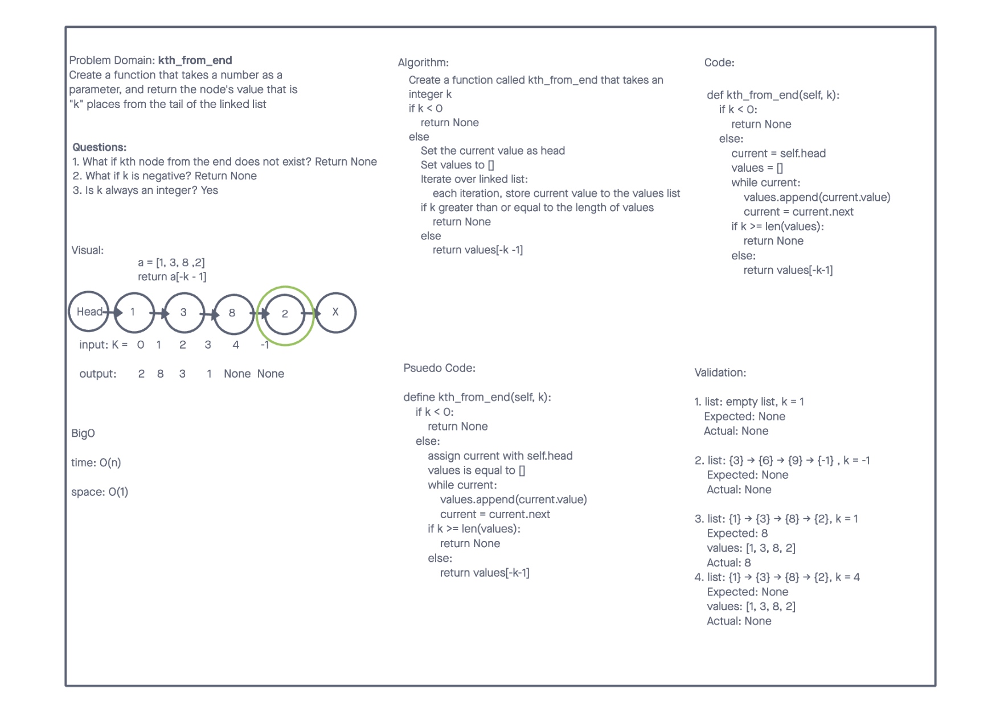
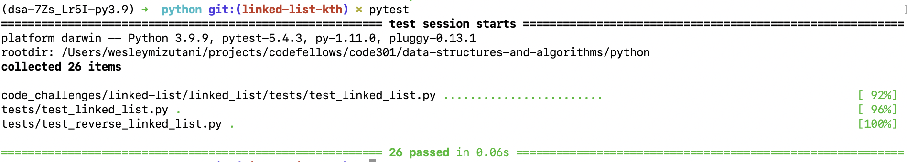

# Code Challenge 7

**Author**: Brandon Mizutani
**Version**: 1.0.0 (Branch: [Git Branch URL](https://github.com/bran2miz/data-structures-and-algorithms/tree/linked-list-kth/python/code_challenges/linked-list/linked_list))

In class we learned about the idea of linked lists and classes. We also learned about the idea that all of the nodes do not have any other information except for their own value and the value of the next node.

## Challenge

This challenge includes linked lists that is comprised of classes. The goal is to find the value of the node that is "k" places from the tail of the linked list.

## Approach & Efficiency

Big O
time: 0(n)
space: 0(1)

## API

The kth_from_end function will iterate through the linked list and look through all the nodes. If the value of k is less than 0 (a negative integer), it will return None. If this is false, then it will iterate through the linked list, appending the current value and traversing through that list. If the k value is greater than or equal to the length of the linked list, return None. Otherwise it will return the value from the tail of the linked list.

## Collaborators

Wenhao Piao

Sources:
Lecture

## Challenge Summary

### Linked Lists kth from end

The challenge was to create a function that:
1.Found the numerical value from "k" places from the linked list

### Whiteboard Process

### Approaches & Efficiency

Big O:

kth_from_end Big O => Time O(n) Space O(1)

## Solution

write pytest in terminal:

**Checklist:**
[x]Top-level README “Table of Contents” is updated
[x] README for this challenge is complete
[x] Summary, Description, Approach & Efficiency, Solution
[x] Picture of whiteboard
[x] Link to code
[x] Feature tasks for this challenge are completed
[x] Unit tests written and passing
[x] “Happy Path” - Expected outcome
[x] Expected failure
[x] Edge Case (if applicable/obvious)

[<==BACK](../../README.md)
