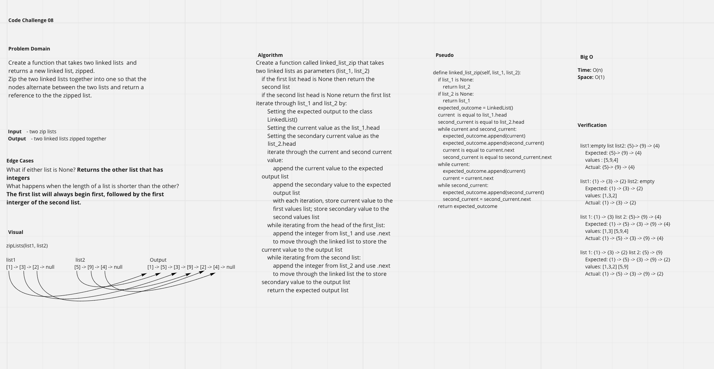

# Code Challenge 8

**Author**: Brandon Mizutani
**Version**: 1.0.0 (Branch: [Git Branch URL](https://github.com/bran2miz/data-structures-and-algorithms/tree/linked-list-kth/python/code_challenges/linked-list/linked_list))

In class we learned about the idea of linked lists and classes. We also learned about the idea that all of the nodes do not have any other information except for their own value and the value of the next node.

## Challenge

This challenge includes linked lists that are zipped together. The goal is to return a new linked list in which the values alternate from the integer of the first linked list to the second integer of the second linked list and so on.

## Approach & Efficiency

Big O
time: 0(n)
space: 0(1)

## API

The linked_list_zip function will iterate through the linked list and look through all the nodes. If the if the second list head is None return the first list. Iterate through list_1 and list_2 by:
Setting the expected output to the class LinkedList()
Setting the current value as the head of the first list
Setting the secondary current value as the head of the second list
Then iterate through the current and second current value:
Append the current and second current value to the LinkedList
With each iteration, store current value to the first values list; store secondary value to the second values list
while iterating from the head of the both lists:
append the integer from the list and use .next to move through the linked list to store the current value to the output list
return the expected output list

## Collaborators

Clarissa Pamonicutt
Roger Huba

Sources:
Lecture

## Challenge Summary

### Linked Lists Zip

The challenge was to create a function that:
1."Zipped" two linked lists together into one so that the nodes alternate between the two lists and return a reference to the the zipped list.

### Whiteboard Process

### Approaches & Efficiency

Big O:

zip Big O => Time O(n) Space O(1)

## Solution

write pytest in terminal:

**Checklist:**
[x]Top-level README “Table of Contents” is updated
[x] README for this challenge is complete
[x] Summary, Description, Approach & Efficiency, Solution
[x] Picture of whiteboard
[x] Link to code
[x] Feature tasks for this challenge are completed
[x] Unit tests written and passing
[x] “Happy Path” - Expected outcome
[x] Expected failure
[x] Edge Case (if applicable/obvious)

[<==BACK](../../README.md)
