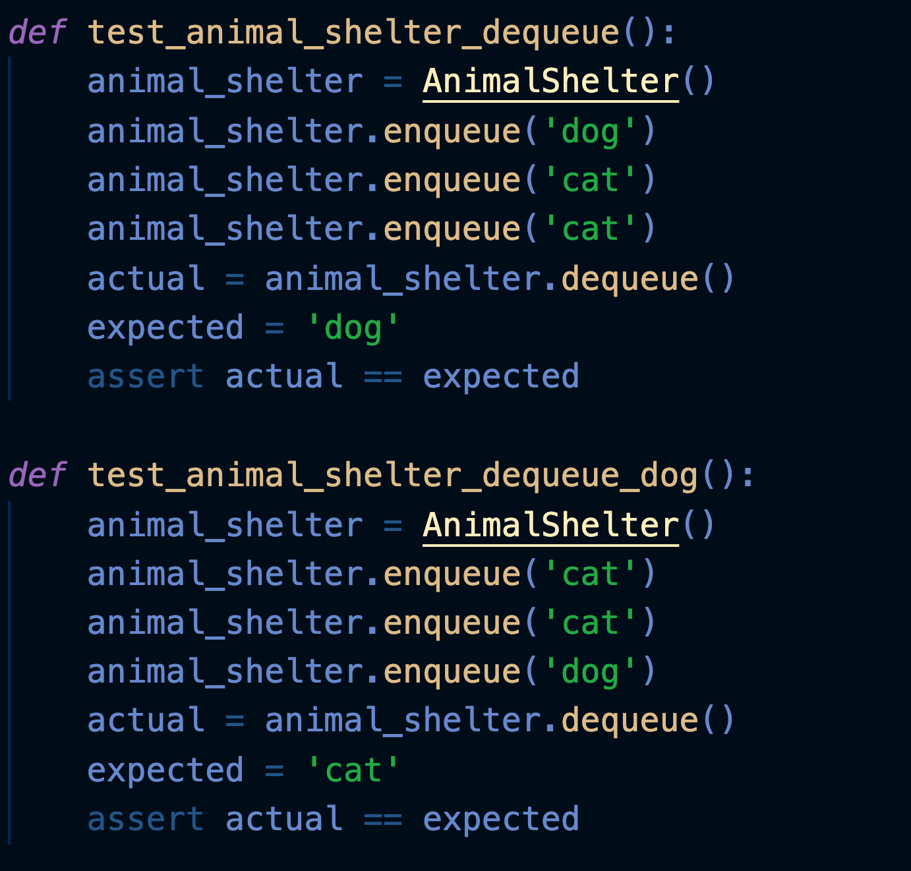
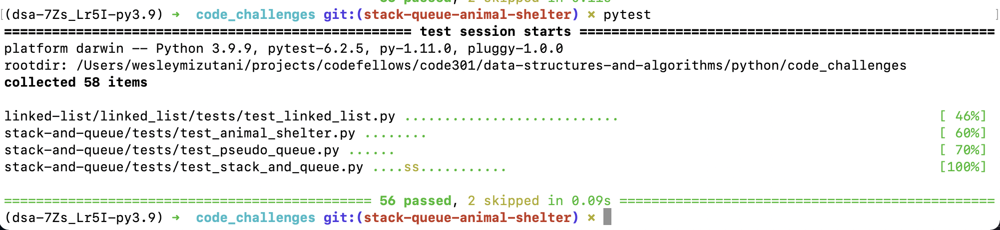
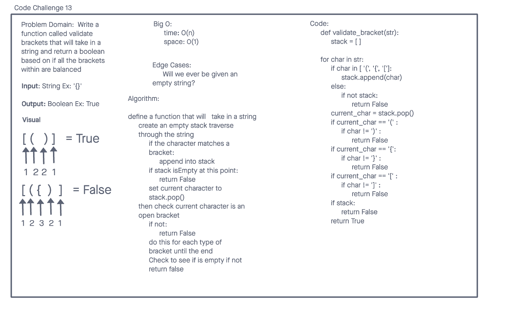
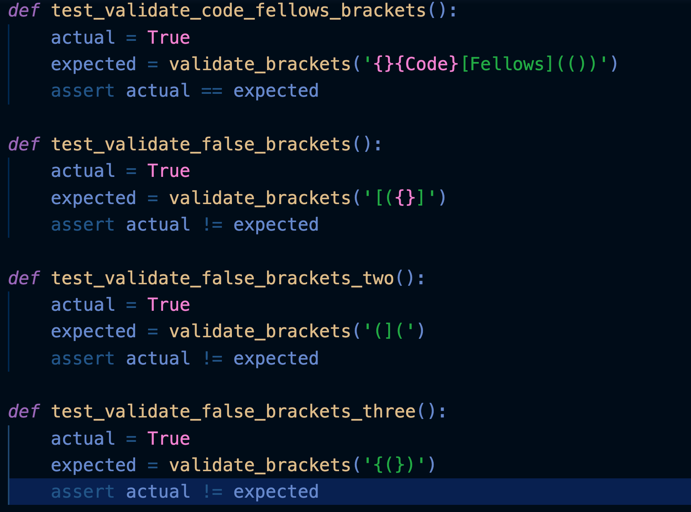
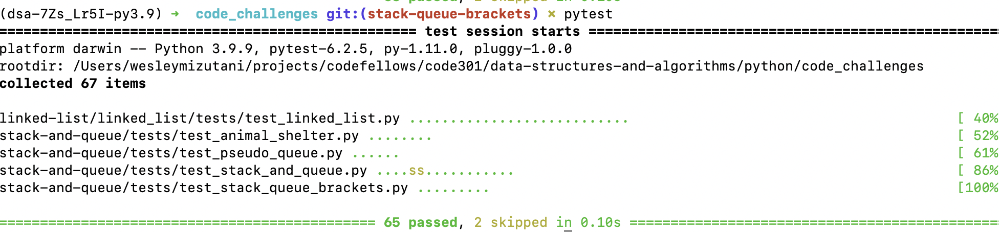

# Stacks and Queues
    With the reading and the lecture from Monday, we were taught stack and queues. The idea of implementation (adding and removing items) might be the same, but the actual methodology is quite different.

    ex. Stack   4(pop function will remove top item)
                3
                2
                1(First in Last Out add item= push)
    ex. Queue
    4 -> 3 -> 2 -> 1 (First in First Out)

## Challenge

The challenge was to create several different stack and queue functions that:

-Added item/s to the Stack or Queue

-Removed item/s from the Stack or Queue

-Peek the Stack(top) or the Queue(front)

-Raised Exception within the Peek or Remove function in case the Stack or Queue were Empty

- Create a function that that checks to see if the Stack or Queue was empty (True or False)

## Approach & Efficiency

The approach I first took was to look at the pseudo code that was provided in the class repo.

I then created separate files for the Node, Queue, and Stack classes.

Doing some refracturing from the psuedo code, I was able to create a solid base code to run some tests with.

Tests were made to compare whether the actual value was returning the expected value

Big O:
time: O(1)
space: change based on the function ie push (O(n))

## API

### Stack

**Push** - Node or items placed into a stack are pushed.

**Pop**- function where Node or items removed from a stack.

**isEmpty**- function that returns True if empty stack; False if not empty.

**Peek**- function to view the top Node's value.exception is raised in case there is an empty queue.

### Queue

**Enqueue**- Node or items added into queue

**Dequeue**- Node or items removed from the queue.

**Peek**- view first Node of the queue. An exception is raised in the beginning in case of an empty queue.

**isEmpty**- returns true when queue is empty; false if not empty.

Collaborators:

Alex Payne
Eddie Ponce
Connor Boyce
Kassie Bradshaw
Roger Huba

## Pseudo Queue Code Challenge 11

[GitHub Link](https://github.com/bran2miz/data-structures-and-algorithms/tree/main/python/code_challenges/stack-and-queue)

From the lecture, we were assigned the task to simulate a queue using only stacks. Because stacks use the FILO(First In Last Out) and LIFO (Last In First Out) principles, we had to first create two separate stacks, and then pop out all the of the first stack and push it into the second stack to return a queue.

    ex. [3] <-first stack   [] <- second stack
        [2]                 []
        [1]                 []

        [] .pop (3,2,1) ->  [1] <- second stack
        []                  [2]
        []                  [3]

    expected output [1] -> [2] -> [3]

### Challenge (Challenge 11)

The challenge was to create a new class named PsuedoQueue that:
-utilized 2 Stack instances to create and manage the queue

The PsuedoQueue class also implemented the *enqueue* and *dequeue* methods to:
-insert value into the PseudoQueue, using a first-in, first-out approach.(enqueue)
-extracts a value from the PseudoQueue, using a first-in, first-out approach.

## Approach & Efficiency (Challenge 11)

The first thing that I did was figure out the visual.

Once I understood the visual, I understood that so long as the first stack was **NOT** empty, we can use the new dequeue method to essentially pop out the value of the items in the first second and push them into the second stack.

Similarly, so long as the second stack was not empty, we can use the enqueue method to pop out the second stack to return those items, but in a queue rather than a stack.

Big O:
time: O(1)
space: O(n)

### Solution

## Animal Shelter Code Challenge 12

[PR](https://github.com/bran2miz/data-structures-and-algorithms/pull/49)

### Challenge (Challenge 12)

The challenge for this lab was to create a class called Animal Shelter which holds only cat and dogs. The shelter operates using a first-in, first-out approach.

### Approach & Efficiency (Challenge 12)

Big O Space: O(n) Time: O(1)

### Solution(Challenge 12)

enqueue: takes one argument that if not equal to dog or cat will return none it will then push that animal into the top of stack one while giving the out stack the new value if needed

dequeue: will take one argument and if that argument is not equal to dog or cat return none if the argument is cat and the top value equals cat op that current top the same applies to if the argument is dog

## Stack and Queue Brackets

### Challenge Summary (Challenge 13)

[GitHub PR](https://github.com/bran2miz/data-structures-and-algorithms/pull/51)

The code challenge today was to create function called validate brackets that takes in a given string with brackets and returns a boolean, representing whether or not the brackets in the string are balanced

## Whiteboard Process (Challenge 13)

## Approach & Efficiency (Challenge 13)

My classmates and I first approached this code challenge with if/else statements to traverse through the string and check if the current character in the string is an open bracket. If not it will return a boolean of False.

However, another method that someone mentioned was to create a dictionary, traverse through the dictionary, and check the opening and closing brackets.

Big O:
time: O(n)
space: O(1)

## Solution (Challenge 13)

### Collaborators

Alex Payne
Eddie Ponce
Michael Greene
Connor Bryce
Roger Huba
TA's

Sources:

[Source](https://stackoverflow.com/questions/69192/how-to-implement-a-queue-using-two-stacks)

[Source](https://towardsdatascience.com/implementation-of-queue-from-two-stacks-in-python-data-structure-c35da025eaf6)
