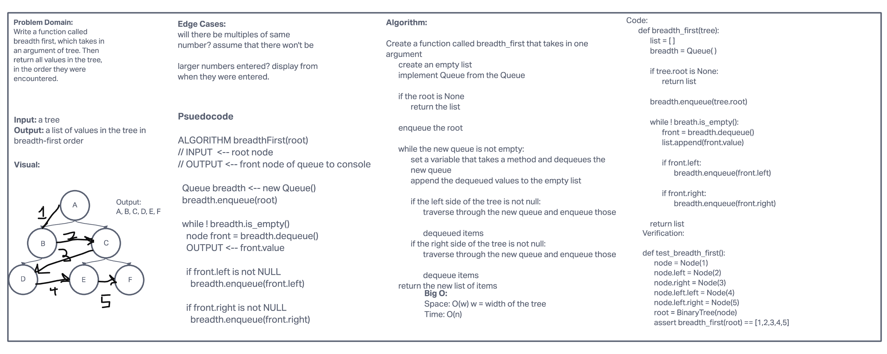
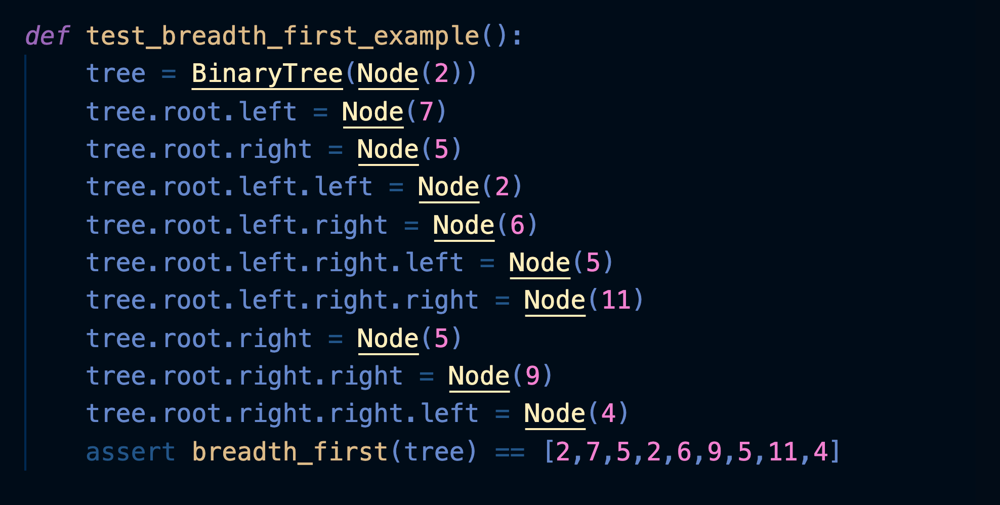
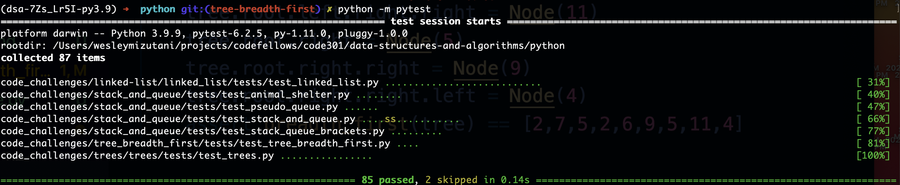

# Challenge Summary

The code challenge today was the breadth-first traversal that returns the list of all values in the tree in the order they were encountered.

## Whiteboard Process

## Approach & Efficiency
<!-- What approach did you take? Why? What is the Big O space/time for this approach? -->
The approach that I first thought to take was to use the queue class. However, because of a difficult time with imports, I thought to use the insert and append method to traverse through the tree. Once I was able to utilize the .pop(), .append(), and .insert() methods, writing the testing became easy. The big O was O(w) sincne we are trying to find the width of the tree and the time is O(n).

## Solution

## Collaborators

Alex Payne

Michael Greene

Connor Boyce

Eddie Ponce
