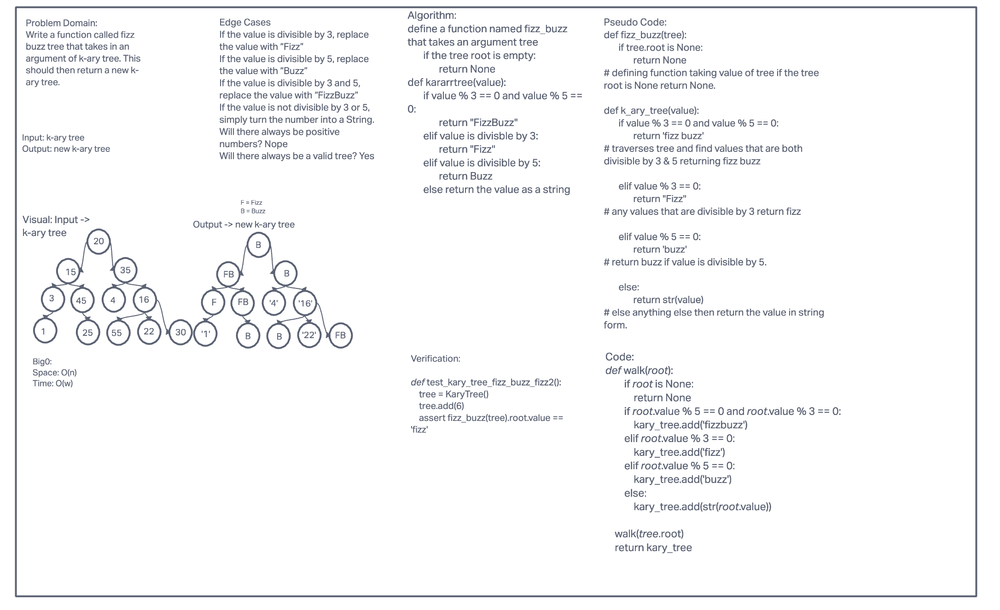
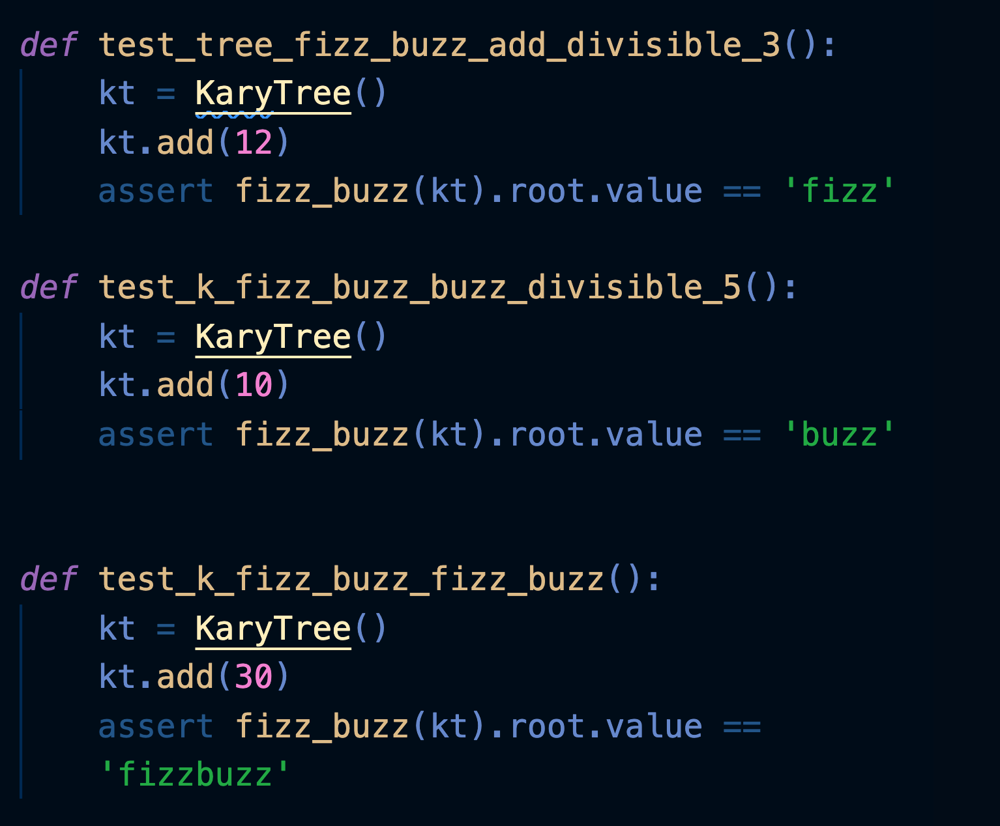
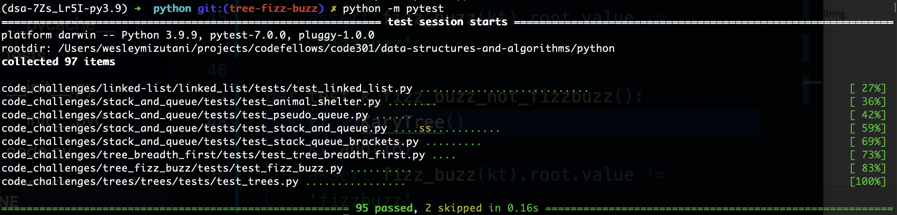

# Code Challenge 18

[PR URL](https://github.com/bran2miz/data-structures-and-algorithms/pull/61)

## Challenge Summary

Conduct “FizzBuzz” on a k-ary tree while traversing through it to create a new tree.

Set the values of each of the new nodes depending on the corresponding node value in the source tree.

## Whiteboard Process

## Approach & Efficiency

The approach that I first took was to create a way to compare whether the current value is divisible by 3, 5, 3 and 5, or neither. I created if/else statements that returned "fizz", "buzz", or "fizzbuzz".

To set the values of each of the new nodes, I created a separate class, KaryTree, within my trees file. The function, add(), contains a walk function that traverse through the left and right hand side. If there is a left node, walk to the left node. If there is no longer a left node, stop there and move to the right node. Traverse and walk to the right until there is no longer a right node.

This KaryTree was implemented into the fizzbuzz function, which essentially will walk through the entire tree to determine which response each integer will return.

## Solution

## Credits and Collaborators

Eddie Ponce

Alex Payne

Roger Huba

TA's
