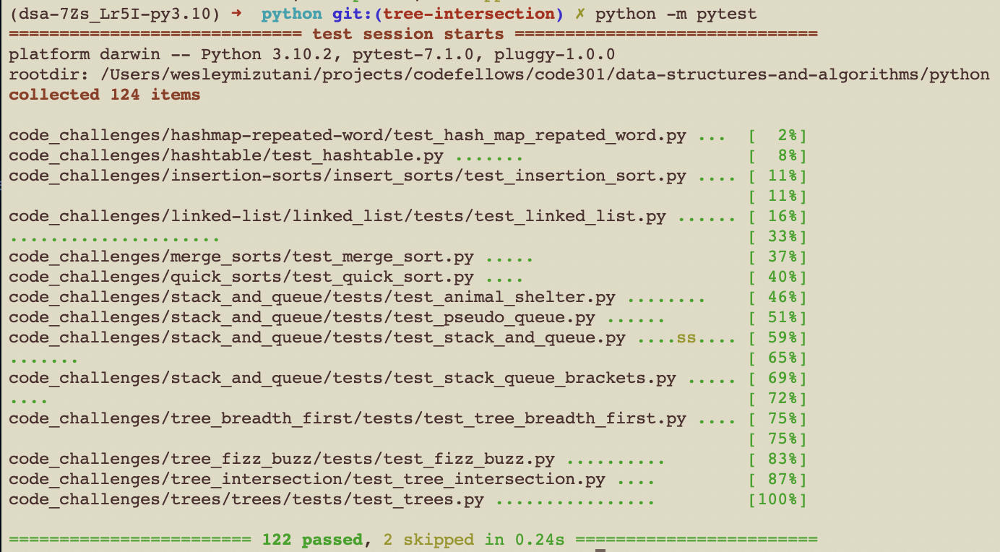

# Challenge Summary

The challenge for today was to find the common values within two binary trees.

## Whiteboard Process

## Approach & Efficiency

The approach that I took was to first utilize the set method from our hashtable assignment. I then incorporated it with the pre_order method, that traversed through the binary tree from root, to the left, then to the right. Using the intersection method, it basically compared the two trees, creating a new list that is the list of the same numbers.

Big O would be the time complexity of O(1) because time is constant. The space complexity would be O(n) because the amount of values within each tree is infinite.

## Solution

## Credits and Collaborators

Alex Payne

Connor Boyce

Eddie Ponce

[Source 1](https://www.w3schools.com/python/ref_set_intersection.asp)

