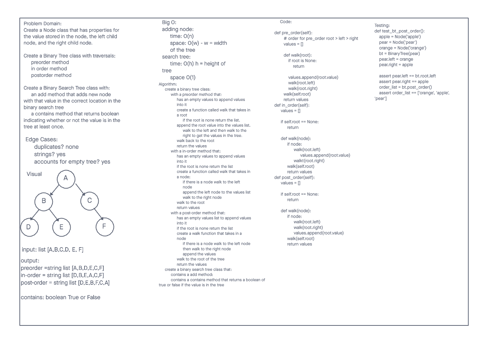

# Trees

Today we learned about trees. From the reading and the lecture, I gained somewhat of an understanding of the depth first traversals within Binary Trees. Pre-order, In-Order, and Post-order were the three methods. We also were given knowledge about Binary Search Trees, where values that are smaller than the root are placed to the left whereas the larger values are implemented to the right.

## Challenge

The first part of the challenge was create three functions that implemented the methods of the depth first traversal. the second part was to create a BinarySearchTree class that contained an "add" and a "contains" method. The add method adds a value into the tree, whereas the contains method returns a boolean of true or false if the value is in the tree.

## Approach & Efficiency

First, I created a whiteboard for the approach and efficiency. The Big O time complexity was log(n), and the space was O(1).

## API

**pre_order** - root >> left >> right
**in_order** - left >> root >> right
**post-order** - left >> right >> root (returns an array of the values, ordered appropriately.)

**add** - Adds a new node with that value in the correct location in the binary search tree.
**contains** - Returns: boolean indicating whether or not the value is in the tree at least once.

## Credits and Collaborators

Alex Payne
Michael Greene
Isaiah Burkes
Eddie Ponce
Connor Boyce

## Sources

[Source 1](https://stackoverflow.com/questions/16505568/inserting-a-value-into-a-binary-search-tree-in-python)

[Source 2](https://cppsecrets.com/users/203121971151041199711011610410311710010510397109971081089764103109971051084699111109/Python-program-to-insert-an-element-into-binary-search-tree.php)

[Source 3](https://codereview.stackexchange.com/questions/201517/bst-implementation-for-insert-put-and-contain-search-in-python)
